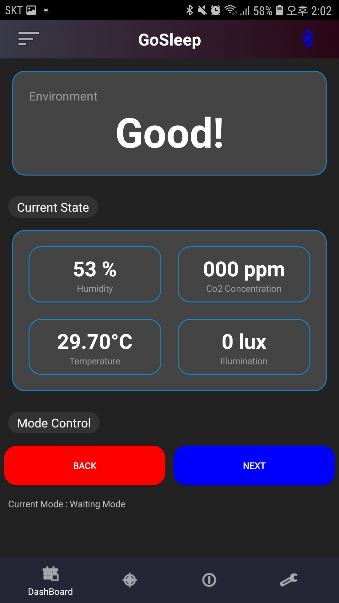
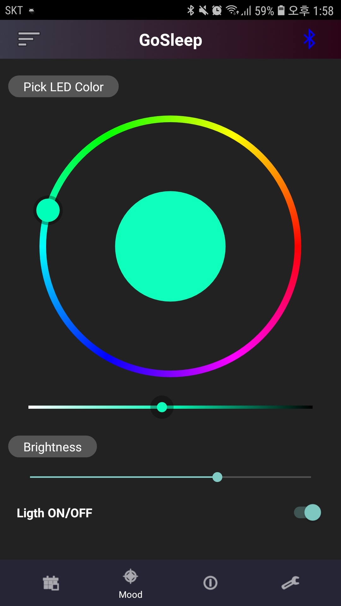
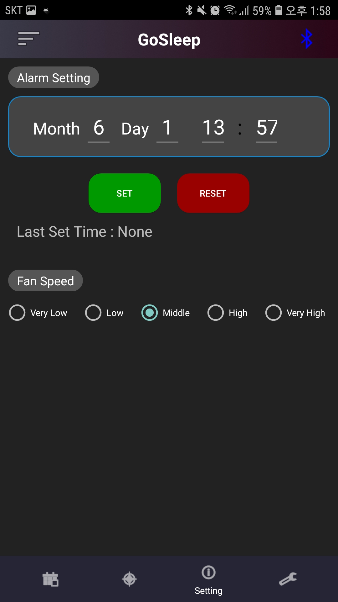
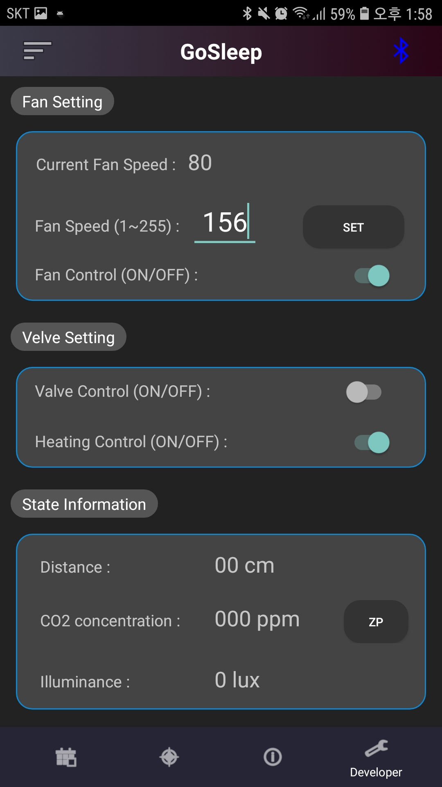

# prototype-gs-app-
[Android, Java]NYXinc. GoSleep **prototype** android application
## Function 1 : Find GoSleep machine autometically ( Bluetooth auto pairing )

  

  

## Function 2 : Sensing

   

## Function 3 : MoodLight Contorl

   

## Function 4 : Setting
Alarm , Fan Speed(5levels)

   

## Function 5 : Developer Mode

   

